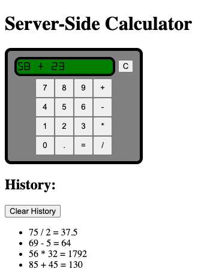

# Server-side Calculator

## Description

*Duration: 3 day task*

A simple calculator app in which calculations are run in the server. It is designed with a layout and functionality meant to emulate traditional physical calculator appearance and user input design, while also displaying a complete history of calculations run. 

## Screenshot

## Pre-requisites

- [Node.js](https://nodejs.org/)

## Installation

1. Clone repo
2. Run `npm install` to acquire express and body-parser
3. `npm start` to start the server. Default port is 5000
4. Use a browser to connect to the server and open the app

## Usage

1. Click the numbered buttons to input the first term of the calculation
2. Click a button with an operator (+, -, *, /) to choose the type of calculation
3. Continue clicking numbered buttons to input the second term of the equation.
4. Click the button with the equals sign to process the calculation, and view the result in the display area
5. Click the button labeled 'clear history' to delete the logged calculations from the server and the browser

## Built With

- [VSCode](https://code.visualstudio.com/)
- [Express](https://www.npmjs.com/package/express)
- [Body Parser](https://www.npmjs.com/package/body-parser)

## Acknowledgement

Thanks to [Prime Digital Academy](https://www.primeacademy.io/) who equipped and helped me to make this application a reality.

## Support

If you have questions, contact me at rutherford.t.b@gmail.com